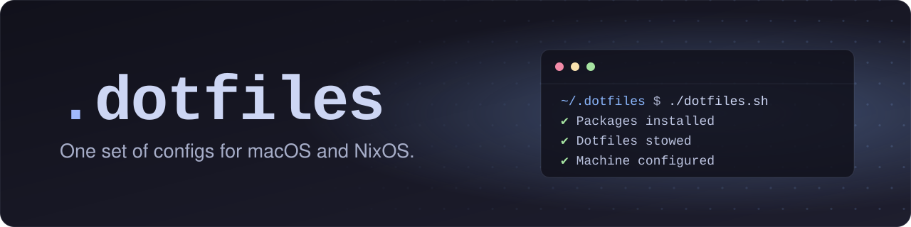

<p align="center">
  
</p>

<p align="center">
  
  <a href="https://github.com/TWinston-66/lattice"></a>
  <a href="https://github.com/TWinston-66/.dotfiles/releases"></a>
  <a href="LICENSE"></a>
</p>

My configs for macOS and NixOS, linked into `$HOME` with
[GNU Stow](https://www.gnu.org/software/stow/). Safe to re-run.

## Install

```sh
curl -fsSL https://raw.githubusercontent.com/TWinston-66/.dotfiles/main/bootstrap.sh | bash
```

This clones the repo to `~/.dotfiles` (override with `DOTFILES_DIR`) and runs
`dotfiles.sh`. Files it would replace are moved to `~/.dotfiles-backup/`.

On NixOS, build [lattice](https://github.com/TWinston-66/lattice) first. It
installs the packages and sets the login shell.

## What it does

| Step | macOS | NixOS |
| --- | :---: | :---: |
| Install packages from the `Brewfile`, plus Claude Code and pi | ✓ | lattice |
| Link configs with Stow | ✓ | ✓ |
| Install tmux plugins | ✓ | ✓ |
| Set zsh as the login shell | ✓ | lattice |
| Apply system defaults, display layout and Touch ID for `sudo` | ✓ | |

**Configs:** bat, btop, ghostty, git, gitmux, lazygit, nvim, sesh, ssh,
starship, tealdeer, tmux, zed and zsh. On macOS, the Rectangle config is copied
in rather than linked.

## Update

```sh
~/.dotfiles/dotfiles.sh
brew update && brew upgrade  # macOS
```

Bumping `VERSION` on `main` publishes a GitHub release.

## License

[MIT](LICENSE)
