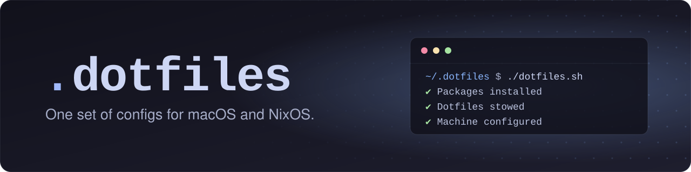

<p align="center">
  
</p>

<p align="center">
  <a href="https://www.apple.com/macos"></a>
  <a href="https://github.com/TWinston-66/lattice"></a>
  <a href="https://www.gnu.org/software/stow/"></a>
  <a href="https://github.com/TWinston-66/.dotfiles/releases"></a>
  <a href="LICENSE"></a>
</p>

<p align="center">
  <b>One set of configs for a Mac and a NixOS desktop.</b><br>
  The terminal, editor and shell are shared between both, and on NixOS the
  <a href="https://github.com/TWinston-66/lattice">lattice</a> desktop is configured here too.
</p>

<p align="center">
  
</p>

## Why these dotfiles

- **One command per machine.** `bootstrap.sh` clones the repo and runs `dotfiles.sh`,
  which works out which OS it's on and does the rest. It's safe to re-run.
- **Nothing gets lost.** Any file Stow would replace is moved to `~/.dotfiles-backup/`
  first, in a folder stamped with the date.
- **The same tools everywhere.** tmux, Neovim, zsh and starship behave the same on
  macOS and NixOS, so the habits carry over. The terminal around them is Ghostty on macOS
  and foot on NixOS; tmux does the tabs and splits on both. On NixOS, lattice ships foot,
  tmux and the rest of the desktop's configs, so this repo keeps only what is personal.
- **Edits apply live.** Configs are symlinked rather than copied, so a change to a bar or
  a keybinding needs no rebuild. On NixOS, they read their colours from lattice's
  generated theme files.

## Install

```sh
curl -fsSL https://raw.githubusercontent.com/TWinston-66/.dotfiles/main/bootstrap.sh | bash
```

This clones the repo to `~/.dotfiles` (override with `DOTFILES_DIR`) and runs
`dotfiles.sh`.

On NixOS, build [lattice](https://github.com/TWinston-66/lattice) first. It
installs the packages and sets the login shell, so this only links configs.

## What it does

| Step | macOS | NixOS |
| --- | :---: | :---: |
| Install packages from the `Brewfile`, plus Claude Code and pi | ✓ | lattice |
| Link configs with Stow | ✓ | ✓ |
| Install tmux plugins | ✓ | lattice |
| Set zsh as the login shell | ✓ | lattice |
| Apply system defaults, display layout and Touch ID for `sudo` | ✓ | |

## Configs

| | Packages |
| --- | --- |
| **Everywhere** | bat, btop, git, lazygit, nvim, pi, sesh, ssh, starship, tealdeer, zed, zsh |
| **NixOS** | hypr, waybar, solaar, desktop entries for apps that wrote their own |
| **macOS** | ghostty, tmux, gitmux; rectangle, copied in rather than linked, since Rectangle imports and renames its file |

## Update

```sh
~/.dotfiles/dotfiles.sh       # re-link configs and re-run setup
brew update && brew upgrade   # macOS packages
scripts/rebuild.sh            # NixOS packages, from the lattice checkout
```

Solaar rewrites `solaar/.config/solaar/config.yaml` every time it starts, so `dotfiles.sh`
marks it skip-worktree and git stops reporting it. To commit a settings change on purpose:

```sh
git update-index --no-skip-worktree solaar/.config/solaar/config.yaml
git commit solaar/.config/solaar/config.yaml
git update-index --skip-worktree solaar/.config/solaar/config.yaml
```

Bumping `VERSION` on `main` publishes a GitHub release.

## License

[MIT](LICENSE)
